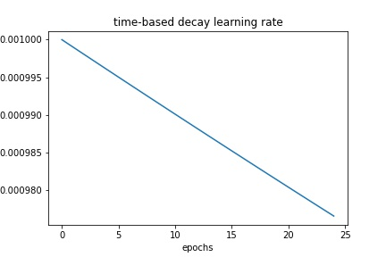
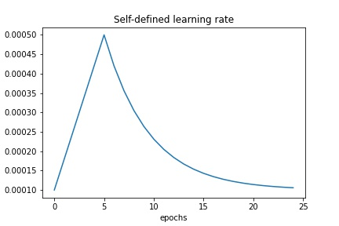
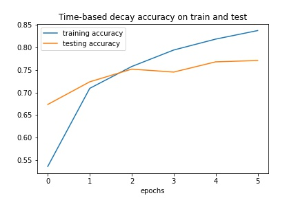
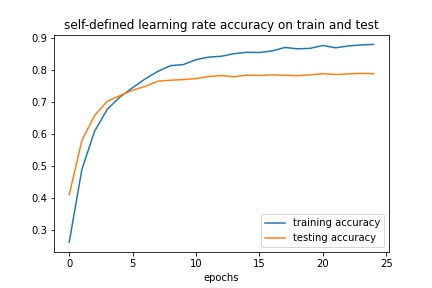
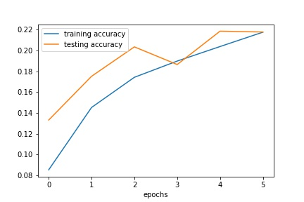
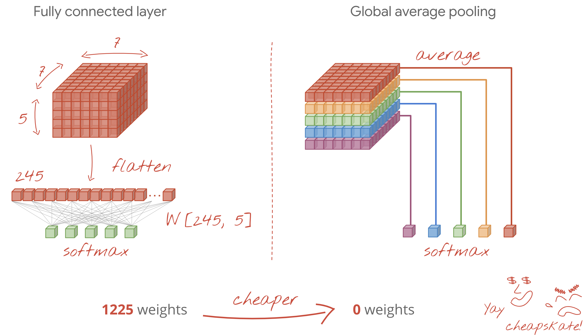

# Kaggle flower images classification using keras model

-------
Kaggle has a competition to identify over 104 classes of flowers. The data provided in the kaggle competition are Tfrecord datasets: labelled train images, labelled val images, unlabelled test images datasets with different image sizes.

------
## Project Objectives
The objective of this project is to:
1) Be able to read and load large Tfrecord datasets
2) Develop a high accuracy multiclassification model for image recognition over 104 classes of flowers
3) Summarize the learning after evaluating various models via different neural network algorithms

## Approach
1) Created a EDA.py for storing all the functions for image loading and augmentation
  ### Constants defined from EDA.py
  * `CLASS`: a list of 400 names of flowers with the index corresponding to the image labels
  * `PATH`: local parent path for test/train/val dataset
  * `TRAIN_FILES`: path associated with all files(labelled) in train data folder
  * `VAL_FILES`: path associated with all files(labelled) in val data folder
  * `TEST_FILES`: path associated with all files (unlabelled but with ID number) in test data folder
  *  Functions defined to load labelled and unlabelled data, do augmentation, normalization on the image data

2) In the modeling notebook, focus on comparing three different models:
  * Conv2D+Maxpooling with 3 hidden layers
  * Conv2D+Maxpooling with dropout layers
  * GlobalAveragePooling2D with LearningRateScheduler and self-defined learning rate algorithms(Time-based decay, Step-based decay and a self-defined learning rate algorithms.)

3) Evaluate the model outcome and summarize the learning on the project
  * compare the compute efficiency and accuracy on val datasets

## Conclusion

* This Capstone demonstrated how to ultilize Tensor Processing Unit (TPU), a distribution strategy that TensowFlow specialized in deep learning tasks by using powerful TPU cores.
* CNN and pre-trained Xception models with self-defined learning rate schedulers were explored to construct deep learning model for multiclass classification. The best model in this project has 78% accuracy on validation dataset. 
  * The best model obtained in this project is pre-trained Xception model with AverageGlobalPooling2D layer model with self-defined learning rate, but the time-based decay learning rate is also as effective. The step-decay learning rate algorithm has slightly lower accuracy, and also it requires much longer time to fit the model (15 epochs).
  |-|Time-based decay|Self-defined learning decay|Conv2d+dropout|
  |---|---|---|---|
  |**Learning rate decay** |||*default in adam optimizer*|
  |**Accuracy plot**||||
 
    * Without playing around with optimzer and learning rate, Conv2D without dropout layer has a tendency to overfit and the best testing accuracy is below 30%. Conv2D with dropout layer helped to control the overfit; however, the final model has low accuracy on both train and val datasets (<30%). Resources suggested that if we can play with the optmizer and learning rate, there is a chance we can improve the CNN model accuracy just as we can for Xception pretrain model.
    * It is, however, interesting to learn that there are fundamental difference between Global Aaverage Pooling and fully connected layer as in CNN.[resources]('https://codelabs.developers.google.com/codelabs/keras-flowers-tpu#11')
    
    

## Acknowledgements

* **Credits to the following resources which inspired and educated me**
    * Special Thanks to **Caroline S.**  for consulting and tips
    * Tensorflow callbacks documentation [Documentation link](https://www.tensorflow.org/guide/keras/custom_callback)
    * Tensorflow image processing documentation [Documentation link](https://www.tensorflow.org/tutorials/images/data_augmentation)
    * Modeling using Imagenet pretrained model [Robert Border](https://www.kaggle.com/rborder/tpu-flower-classification?kernelSessionId=78320658)[, Umar Farooq](https://medium.com/@imUmarFarooq/computer-vision-petals-to-the-metal-3465d66ad343)
    * Learning rate scheduler and callback functions [Bachr Chi](https://medium.com/@bechr7/learning-rate-scheduling-with-callbacks-in-tensorflow-e2ba83647013) [Udacity PyTordh Chllengers](https://medium.com/udacity-pytorch-challengers/ideas-on-how-to-fine-tune-a-pre-trained-model-in-pytorch-184c47185a20)
---
